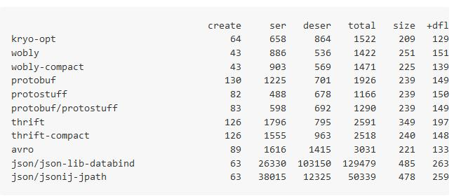

[学习-作业](https://github.com/tracholar/ml-homework-cz)

1. 为什么要使用thrift来定义接口,有什么好处?
- 可以认为thrift是一个二进制协议和rpc框架，处理了底层通信和序列化的细节；
- idl 定义 与具体的语言无关；可以自动生成各种语言的实现；
- 特性丰富（字段类型）；性能较高；

2. thrift的序列化与JSON和XML序列化之间的差异和优劣是什么?
- thrift 二进制协议，自动生成的代码中已经包含了序列化和反序列化相关的细节；开发不需要关心这些细节；而且效率比较高，缺点是二进制不是human-readable(这也不算缺点啦)
- XML是一种常用的序列化和反序列化协议，具有跨机器，跨语言等优点。序列化对象的时候，就显得冗长而复杂。
- json, 符合工程师对对象的理解;Human-readable; 应用广泛，ajax事实上的标准；协议比较简单，解析速度比较快，但是还是一个文本协议，效率应该不如thrift；


3. 用自己的话描述一下RPC和本地函数调用的关系与区别,请举一个例子进行描述
- rpc是为了“像调用本地方法一样调用远程方法”；消息的传递是需要通过网络进行传输的（通过消息传递来进行通信）；调用函数和被调用函数往往运行在不同的机器上；
- 本地方法是通过 共享内存 的方式类通信的；
- [rpc](https://www.zhihu.com/question/41609070)

4. spring bean是什么? 请举例说明
- java实例；

5. junit 的@Before 和 @After有什么用途? 请在你的单元测试中使用一次
- @Before：初始化方法   对于每一个测试方法都要执行一次（注意与BeforeClass区别，后者是对于所有方法执行一次）
- @After：释放资源  对于每一个测试方法都要执行一次（注意与AfterClass区别，后者是对于所有方法执行一次）
- @Test：测试方法，在这里可以测试期望异常和超时时间 
- 一个JUnit4的单元测试用例执行顺序为： @BeforeClass -> @Before -> @Test -> @After -> @AfterClass; 
- 每一个测试方法的调用顺序为：  @Before -> @Test -> @After; 

6. 阅读以下fb303.thrift的源代码,请描述一下它做了哪些事情?

```thrift
/*
 * Licensed to the Apache Software Foundation (ASF) under one
 * or more contributor license agreements. See the NOTICE file
 * distributed with this work for additional information
 * regarding copyright ownership. The ASF licenses this file
 * to you under the Apache License, Version 2.0 (the
 * "License"); you may not use this file except in compliance
 * with the License. You may obtain a copy of the License at
 *
 *   http://www.apache.org/licenses/LICENSE-2.0
 *
 * Unless required by applicable law or agreed to in writing,
 * software distributed under the License is distributed on an
 * "AS IS" BASIS, WITHOUT WARRANTIES OR CONDITIONS OF ANY
 * KIND, either express or implied. See the License for the
 * specific language governing permissions and limitations
 * under the License.
 */

/**
 * fb303.thrift
 */

namespace java com.facebook.fb303
namespace cpp facebook.fb303
namespace perl Facebook.FB303
namespace netcore Facebook.FB303.Test

/**
 * Common status reporting mechanism across all services
 */
enum fb_status {
  DEAD = 0,
  STARTING = 1,
  ALIVE = 2,
  STOPPING = 3,
  STOPPED = 4,
  WARNING = 5,
}

/**
 * Standard base service
 */
service FacebookService {

  /**
   * Returns a descriptive name of the service
   */
  string getName(),

  /**
   * Returns the version of the service
   */
  string getVersion(),

  /**
   * Gets the status of this service
   */
  fb_status getStatus(),

  /**
   * User friendly description of status, such as why the service is in
   * the dead or warning state, or what is being started or stopped.
   */
  string getStatusDetails(),

  /**
   * Gets the counters for this service
   */
  map<string, i64> getCounters(),

  /**
   * Gets the value of a single counter
   */
  i64 getCounter(1: string key),

  /**
   * Sets an option
   */
  void setOption(1: string key, 2: string value),

  /**
   * Gets an option
   */
  string getOption(1: string key),

  /**
   * Gets all options
   */
  map<string, string> getOptions(),

  /**
   * Returns a CPU profile over the given time interval (client and server
   * must agree on the profile format).
   */
  string getCpuProfile(1: i32 profileDurationInSec),

  /**
   * Returns the unix time that the server has been running since
   */
  i64 aliveSince(),

  /**
   * Tell the server to reload its configuration, reopen log files, etc
   */
  oneway void reinitialize(),

  /**
   * Suggest a shutdown to the server
   */
  oneway void shutdown(),

}

```